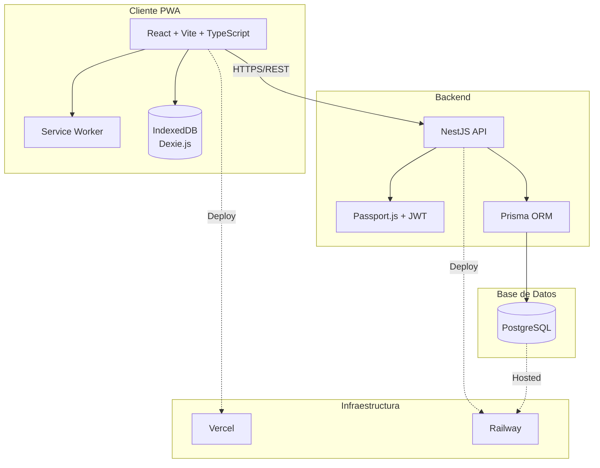
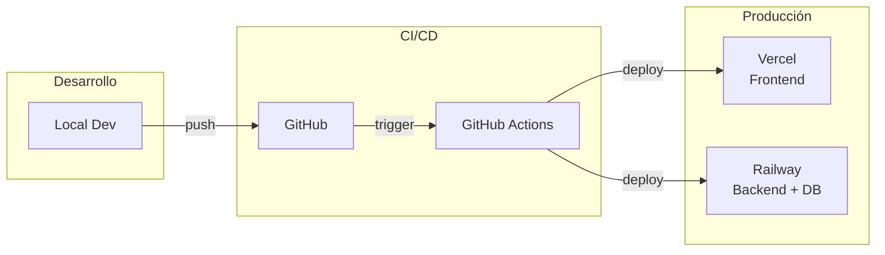
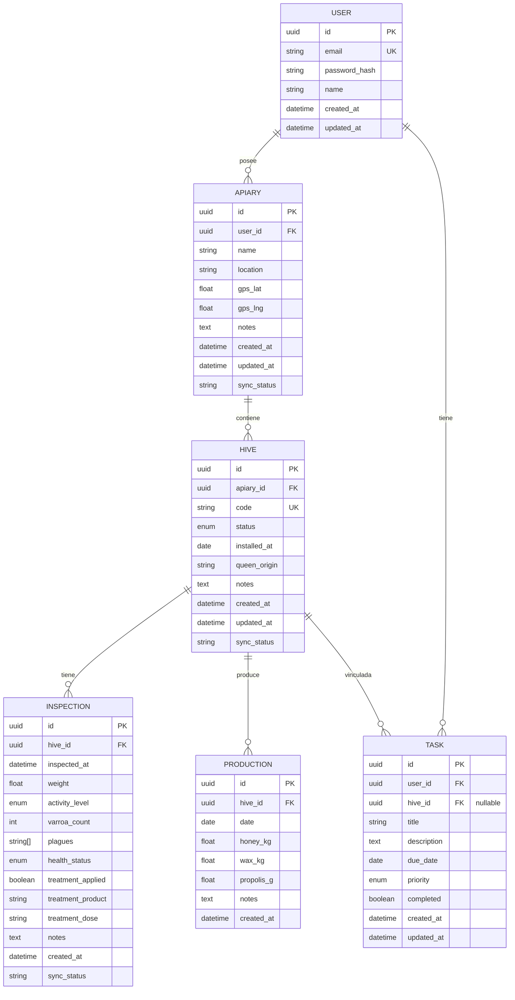

# COLMENAPP - Gestión Profesional de Apiarios

## Índice

0. [Ficha del proyecto](#0-ficha-del-proyecto)
1. [Descripción general del producto](#1-descripción-general-del-producto)
2. [Arquitectura del sistema](#2-arquitectura-del-sistema)
3. [Modelo de datos](#3-modelo-de-datos)
4. [Especificación de la API](#4-especificación-de-la-api)
5. [Historias de usuario](#5-historias-de-usuario)
6. [Tickets de trabajo](#6-tickets-de-trabajo)
7. [Pull requests](#7-pull-requests)

---

## 0. Ficha del Proyecto

| Campo | Valor |
|-------|-------|
| **Nombre completo** | Carlos San Juan Martin |
| **Nombre del proyecto** | COLMENAPP |
| **Descripción breve** | Aplicación web PWA para la gestión profesional de apiarios y colmenas, con funcionamiento offline-first, diseñada para apicultores con 100+ colmenas que necesitan registrar datos de campo de manera eficiente |
| **URL del proyecto** | *Pendiente de despliegue* |
| **URL del repositorio** | https://github.com/CarlosSJM/COLMENAPP |

### Ramas del proyecto

```
feature-entrega1-CSM    → Entrega 1: Documentación técnica
feature-entrega2-CSM    → Entrega 2: Código funcional
finalproject-CSM        → Entrega final
```

---

## 1. Descripción General del Producto

### 1.1. Objetivo

**COLMENAPP** es una aplicación web progresiva (PWA) diseñada para apicultores profesionales que gestionan múltiples apiarios y necesitan:

- **Organizar** apiarios y colmenas con identificación QR
- **Registrar** datos de campo de manera eficiente (peso, varroa, tratamientos)
- **Trabajar offline** en zonas rurales sin cobertura
- **Sincronizar** automáticamente cuando recuperen conexión
- **Exportar** datos para análisis y trazabilidad

**Problema que resuelve:** Los apicultores profesionales utilizan actualmente cuadernos de papel o apps genéricas que no funcionan sin internet en el campo, perdiendo datos o duplicando trabajo.

**Usuario objetivo:** Apicultor profesional con 100+ colmenas distribuidas en múltiples apiarios.

### 1.2. Características y Funcionalidades Principales

#### MVP (Entrega Final)

| # | Funcionalidad | Descripción |
|---|---------------|-------------|
| 1 | **Autenticación** | Registro/login con email, recuperación de contraseña, sesión persistente |
| 2 | **Gestión de Apiarios** | CRUD completo: nombre, ubicación, GPS opcional, notas |
| 3 | **Gestión de Colmenas** | CRUD con estado (activa/cuarentena/pérdida), código único, origen reina |
| 4 | **Sistema QR** | Generación automática de QR por colmena, scanner para acceso rápido |
| 5 | **Registro de Inspecciones** | Peso, actividad, conteo varroa, plagas, tratamientos, notas |
| 6 | **Historial** | Visualización cronológica de inspecciones por colmena |
| 7 | **Modo Offline** | Funciona sin conexión, sync automático al recuperar red |
| 8 | **Dashboard** | Resumen de colmenas por estado, últimas inspecciones, alertas |
| 9 | **Exportación CSV** | Descarga de datos por apiario o global |

#### Excluido del MVP (Fases futuras)

- Fotos con geolocalización
- Transcripción de voz
- Multiusuario con roles
- Calendario y notificaciones push
- NFC
- Marketplace
- IA/ML predictivo

### 1.3. Diseño y Experiencia de Usuario

#### Principios de diseño

- **Mobile-first**: Optimizado para uso en campo con móvil
- **Botones grandes**: Mínimo 48px para uso con guantes
- **Alto contraste**: Visibilidad bajo luz solar directa
- **Offline-first**: Indicadores claros de estado de conexión

#### Flujo principal del usuario

```
1. Login → Dashboard
2. Dashboard → Seleccionar Apiario → Ver Colmenas
3. Escanear QR → Ficha Colmena → Nueva Inspección
4. Rellenar datos → Guardar (local) → Sync automático
```

#### Diseño UI

Los diseños se crearon en Figma AI y se exportaron como código React funcional. Se realizó una comparación punto por punto entre el diseño y la documentación técnica, resultando en 9 decisiones de diseño documentadas (ver `docs/design/DESIGN_DECISIONS.md`).

**9 pantallas implementadas:** Login, Register, ForgotPassword, Dashboard, Apiaries, Hives (+ QR), Inspections, Production, Tasks

### 1.4. Instrucciones de Instalación

**Requisitos:**
- Node.js 20+
- Docker (para PostgreSQL)
- npm

```bash
# 1. Clonar repositorio
git clone https://github.com/CarlosSJM/COLMENAPP.git
cd COLMENAPP

# 2. Levantar PostgreSQL con Docker
docker compose up -d

# 3. Backend
cd backend
cp ../.env.example .env
npm install
npx prisma migrate dev
npx prisma db seed        # Datos de prueba (demo@colmenapp.com / 123456)
npm run start:dev          # Puerto 3000

# 4. Frontend (en otra terminal)
cd frontend
npm install
npm run dev                # Puerto 5173
```

**Acceder a la app:** http://localhost:5173
**Usuario demo:** `demo@colmenapp.com` / `123456`

**Puertos:**
| Servicio | Puerto |
|----------|--------|
| Frontend (Vite) | 5173 |
| Backend (NestJS) | 3000 |
| PostgreSQL (Docker) | 5434 |

---

## 2. Arquitectura del Sistema

### 2.1. Diagrama de Arquitectura



**Justificación de la arquitectura:**

| Decisión | Justificación |
|----------|---------------|
| **PWA** | Una sola base de código para web y móvil, instalable sin stores |
| **Offline-first** | Dexie.js + Service Worker para funcionar sin conexión en campo |
| **Backend propio (NestJS)** | Familiaridad del desarrollador, control total, TypeScript nativo |
| **PostgreSQL** | Robusto, gratuito, estándar de la industria |
| **Vercel + Railway** | Costes mínimos (~6€/mes), fácil despliegue, escalable |

### 2.2. Descripción de Componentes Principales

| Componente | Tecnología | Responsabilidad |
|------------|------------|-----------------|
| **Frontend PWA** | React 18 + Vite + TypeScript | Interfaz de usuario, lógica de presentación |
| **UI Components** | Tailwind CSS + shadcn/ui | Componentes accesibles, diseño responsive |
| **Offline Storage** | Dexie.js (IndexedDB) | Persistencia local, cola de sincronización |
| **Service Worker** | vite-plugin-pwa | Caché de assets, funcionamiento offline |
| **i18n** | react-i18next | Internacionalización (ES inicial, preparado para EN, PT...) |
| **API REST** | NestJS + Express | Endpoints, validación, lógica de negocio |
| **Autenticación** | Passport.js + JWT + bcrypt | Login, registro, tokens, hash de passwords |
| **ORM** | Prisma | Acceso a BD, migraciones, type-safety |
| **Base de datos** | PostgreSQL 14+ | Persistencia de datos, relaciones |

### 2.3. Descripción de Alto Nivel del Proyecto y Estructura de Ficheros

```
COLMENAPP/
├── frontend/
│   ├── src/
│   │   ├── components/
│   │   │   ├── auth/          # Login, Register, ForgotPassword
│   │   │   ├── ui/            # shadcn/ui components
│   │   │   ├── Dashboard.tsx
│   │   │   ├── Apiaries.tsx
│   │   │   ├── Hives.tsx
│   │   │   ├── Inspections.tsx
│   │   │   ├── Production.tsx
│   │   │   ├── Tasks.tsx
│   │   │   ├── Layout.tsx
│   │   │   ├── QRModal.tsx
│   │   │   ├── QRScanner.tsx
│   │   │   └── ConfirmDeleteDialog.tsx
│   │   ├── contexts/          # AuthContext (auth + online status)
│   │   ├── services/          # API client + adapters
│   │   ├── hooks/             # useApiData
│   │   ├── types/             # TypeScript interfaces
│   │   ├── utils/             # enums mapping, cn helper
│   │   ├── data/              # Mock data (desarrollo)
│   │   └── App.tsx            # Router + rutas protegidas
│   ├── public/
│   │   ├── manifest.json      # PWA manifest
│   │   └── sw.js              # Service Worker
│   └── package.json
│
├── backend/
│   ├── src/
│   │   ├── auth/              # Register, login, JWT, guards
│   │   ├── apiaries/          # CRUD apiarios + ownership
│   │   ├── hives/             # CRUD colmenas + QR code lookup
│   │   ├── inspections/       # CRUD inspecciones + last_inspection
│   │   ├── production/        # CRUD producción + stats
│   │   ├── tasks/             # CRUD tareas + toggle
│   │   ├── dashboard/         # Stats agregadas
│   │   ├── prisma/            # PrismaService global
│   │   └── main.ts            # ValidationPipe, CORS
│   ├── prisma/
│   │   ├── schema.prisma      # 6 modelos, 7 enums
│   │   ├── migrations/        # 2 migraciones
│   │   └── seed.ts            # Datos de prueba
│   ├── test/                  # 34 tests e2e
│   └── package.json
│
├── docs/                      # 21 documentos organizados
│   ├── architecture/
│   ├── database/
│   ├── design/
│   ├── features/
│   ├── infrastructure/
│   ├── testing/
│   └── aprendizajes.md
│
├── CLAUDE.md                  # Instrucciones para Claude Code
├── docker-compose.yml         # PostgreSQL 16
├── README.md
└── prompts.md                 # 27 prompts documentados
```

**Patrón arquitectónico:**
- **Frontend**: Componentes funcionales + hooks, padres con lógica, hijos presentacionales
- **Backend**: Arquitectura modular NestJS (módulo por dominio), ownership isolation en todas las queries

### 2.4. Infraestructura y Despliegue



**Entornos:**

| Entorno | Frontend | Backend | Base de Datos |
|---------|----------|---------|---------------|
| **Local** | localhost:5173 | localhost:3000 | PostgreSQL local |
| **Producción** | Vercel (auto) | Railway | Railway PostgreSQL |

**Proceso de despliegue:**

1. Push a rama `main` → GitHub Actions
2. Frontend: Build Vite → Deploy Vercel (automático)
3. Backend: Build NestJS → Deploy Railway (automático)
4. Migraciones Prisma ejecutadas en Railway

**Costes estimados MVP:**

| Servicio | Coste/mes |
|----------|-----------|
| Vercel (Free) | 0€ |
| Railway (Hobby) | ~5€ |
| **Total** | **~5€/mes** |

### 2.5. Seguridad

| Área | Medida | Estado |
|------|--------|--------|
| **Autenticación** | JWT con expiración 24h | ✅ Implementado |
| **Passwords** | Hash bcrypt (salt 10) | ✅ Implementado |
| **password_hash** | Nunca expuesto en responses (select explícito) | ✅ Verificado |
| **Ownership isolation** | Toda query filtra por user_id | ✅ Verificado (3 fixes aplicados) |
| **Input validation** | class-validator en todos los DTOs, whitelist activo | ✅ Implementado |
| **CORS** | Restringido a origen del frontend | ✅ Corregido |
| **SQL Injection** | Prisma ORM, no queries raw | ✅ Verificado |
| **Rate limiting** | Pendiente (@nestjs/throttler) | ⚠️ Pendiente producción |
| **Helmet.js** | Pendiente (headers seguridad) | ⚠️ Pendiente producción |

**Revisión de seguridad completada:** 3 vulnerabilidades encontradas y corregidas (ver `docs/testing/security-review.md`)

### 2.6. Tests

**58 tests implementados y pasando:**

| Tipo | Tests | Herramienta | Que valida |
|------|-------|-------------|-----------|
| **E2E Backend** | 34 | Jest + Supertest | Endpoints reales contra BD PostgreSQL |
| **Unitarios Backend** | 24 | Jest + Mocks | Lógica de negocio aislada |
| **Frontend** | - | Pendiente | Pendiente para v2 |

**Tests E2E (34):**

| Suite | Tests | Cobertura |
|-------|-------|-----------|
| Auth | 10 | Register, login, validación, token, password_hash oculto |
| Apiaries | 13 | CRUD + ownership isolation con 2 usuarios |
| Hives | 7 | CRUD + hive_count sync + code lookup (QR) |
| Inspections | 4 | CRUD + last_inspection update |

**Tests Unitarios (24):**

| Suite | Tests | Cobertura |
|-------|-------|-----------|
| AuthService | 7 | Hash bcrypt, login, profile sin hash |
| ApiariesService | 6 | Ownership, user_id filter |
| HivesService | 6 | hive_count sync, findByCode |
| InspectionsService | 5 | last_inspection update, ownership |

**Ejecución:**
```bash
cd backend

# Tests e2e (requiere Docker PostgreSQL corriendo)
npx jest --config test/jest-e2e.json --forceExit

# Tests unitarios (sin BD, solo mocks)
npx jest src/**/*.service.spec.ts --forceExit
```

**Revisión de seguridad:** 3 vulnerabilidades encontradas y corregidas (ver `docs/testing/security-review.md`)

---

## 3. Modelo de Datos

### 3.1. Diagrama del Modelo de Datos



**Relaciones:**
- Un **Usuario** tiene muchos **Apiarios** y muchas **Tareas**
- Un **Apiario** tiene muchas **Colmenas**
- Una **Colmena** tiene muchas **Inspecciones**, **Producciones** y **Tareas** (opcional)
- Eliminar Usuario → CASCADE a todo
- Eliminar Colmena → SET NULL en Tareas (no se pierden)

### 3.2. Descripción de Entidades Principales

#### USER (Usuario)

| Campo | Tipo | Restricciones | Descripción |
|-------|------|---------------|-------------|
| id | UUID | PK | Identificador único |
| email | VARCHAR(255) | UNIQUE, NOT NULL | Email del usuario |
| password_hash | VARCHAR(255) | NOT NULL | Hash bcrypt del password |
| name | VARCHAR(100) | NOT NULL | Nombre del usuario |
| created_at | TIMESTAMP | NOT NULL | Fecha de registro |
| updated_at | TIMESTAMP | NOT NULL | Última modificación |

#### APIARY (Apiario)

| Campo | Tipo | Restricciones | Descripción |
|-------|------|---------------|-------------|
| id | UUID | PK | Identificador único |
| user_id | UUID | FK → USER, NOT NULL | Propietario |
| name | VARCHAR(100) | NOT NULL | Nombre del apiario |
| location | VARCHAR(255) | | Ubicación (texto) |
| gps_lat | DECIMAL(10,8) | | Latitud GPS |
| gps_lng | DECIMAL(11,8) | | Longitud GPS |
| notes | TEXT | | Notas adicionales |
| created_at | TIMESTAMP | NOT NULL | Fecha de creación |
| updated_at | TIMESTAMP | NOT NULL | Última modificación |
| sync_status | VARCHAR(20) | DEFAULT 'synced' | Estado sync: pending/synced |

#### HIVE (Colmena)

| Campo | Tipo | Restricciones | Descripción |
|-------|------|---------------|-------------|
| id | UUID | PK | Identificador único |
| apiary_id | UUID | FK → APIARY, NOT NULL | Apiario al que pertenece |
| code | VARCHAR(50) | UNIQUE por user, NOT NULL | Código identificador |
| status | ENUM | NOT NULL | active/inactive/quarantine/lost |
| installed_at | DATE | | Fecha de instalación |
| queen_origin | VARCHAR(255) | | Origen de la reina |
| notes | TEXT | | Notas adicionales |
| created_at | TIMESTAMP | NOT NULL | Fecha de creación |
| updated_at | TIMESTAMP | NOT NULL | Última modificación |
| sync_status | VARCHAR(20) | DEFAULT 'synced' | Estado sync |

#### INSPECTION (Inspección)

| Campo | Tipo | Restricciones | Descripción |
|-------|------|---------------|-------------|
| id | UUID | PK | Identificador único |
| hive_id | UUID | FK → HIVE, NOT NULL | Colmena inspeccionada |
| inspected_at | TIMESTAMP | NOT NULL | Fecha/hora de inspección |
| weight | DECIMAL(5,2) | | Peso en kg |
| activity_level | ENUM | | low/medium/high |
| varroa_count | INTEGER | | Conteo de varroa |
| plagues | VARCHAR[] | | Array de plagas detectadas |
| health_status | ENUM | | good/regular/bad |
| treatment_applied | BOOLEAN | DEFAULT false | ¿Se aplicó tratamiento? |
| treatment_product | VARCHAR(100) | | Producto usado |
| treatment_dose | VARCHAR(50) | | Dosis aplicada |
| notes | TEXT | | Notas adicionales |
| created_at | TIMESTAMP | NOT NULL | Fecha de creación |
| sync_status | VARCHAR(20) | DEFAULT 'synced' | Estado sync |

---

## 4. Especificación de la API

**Base URL:** `/api/v1`
**Autenticación:** Bearer JWT en header `Authorization` (excepto register/login)
**Swagger Docs:** `/api/docs` (credenciales: `colmenapp` / `1234colmenapp`)

### Auth (3 endpoints)

| Método | Ruta | Descripción | Auth |
|--------|------|-------------|------|
| POST | `/auth/register` | Crear cuenta (name, email, password) | No |
| POST | `/auth/login` | Login, devuelve access_token | No |
| GET | `/auth/me` | Perfil del usuario autenticado | JWT |

### Apiaries (6 endpoints)

| Método | Ruta | Descripción |
|--------|------|-------------|
| GET | `/apiaries` | Listar apiarios del usuario |
| POST | `/apiaries` | Crear apiario |
| GET | `/apiaries/:id` | Obtener apiario (ownership check) |
| PUT | `/apiaries/:id` | Actualizar apiario |
| DELETE | `/apiaries/:id` | Eliminar apiario (CASCADE) |
| GET | `/apiaries/:id/hives` | Listar colmenas del apiario |

### Hives (6 endpoints)

| Método | Ruta | Descripción |
|--------|------|-------------|
| GET | `/hives` | Listar todas las colmenas |
| POST | `/hives` | Crear colmena (code único) |
| GET | `/hives/:id` | Obtener colmena |
| PUT | `/hives/:id` | Actualizar colmena |
| DELETE | `/hives/:id` | Eliminar colmena (CASCADE) |
| GET | `/hives/code/:code` | Buscar por código (QR scanner) |

### Inspections (6 endpoints)

| Método | Ruta | Descripción |
|--------|------|-------------|
| GET | `/inspections` | Listar inspecciones |
| POST | `/inspections` | Crear inspección (actualiza last_inspection) |
| GET | `/inspections/:id` | Obtener inspección |
| PUT | `/inspections/:id` | Actualizar inspección |
| DELETE | `/inspections/:id` | Eliminar inspección |
| GET | `/hives/:id/inspections` | Inspecciones de una colmena |

### Productions (7 endpoints)

| Método | Ruta | Descripción |
|--------|------|-------------|
| GET | `/productions` | Listar registros de producción |
| POST | `/productions` | Registrar producción |
| GET | `/productions/:id` | Obtener registro |
| PUT | `/productions/:id` | Actualizar registro |
| DELETE | `/productions/:id` | Eliminar registro |
| GET | `/productions/stats` | Estadísticas agregadas |
| GET | `/hives/:id/productions` | Producción de una colmena |

### Tasks (6 endpoints)

| Método | Ruta | Descripción |
|--------|------|-------------|
| GET | `/tasks` | Listar tareas del usuario |
| POST | `/tasks` | Crear tarea |
| GET | `/tasks/:id` | Obtener tarea |
| PUT | `/tasks/:id` | Actualizar tarea |
| PATCH | `/tasks/:id/toggle` | Toggle completada |
| DELETE | `/tasks/:id` | Eliminar tarea |

### Dashboard (1 endpoint)

| Método | Ruta | Descripción |
|--------|------|-------------|
| GET | `/dashboard/stats` | Estadísticas: colmenas por estado, atención requerida, inspecciones pendientes, tareas, colmenas por apiario, últimas inspecciones |

**Total: 33 endpoints** | Todos protegidos con JWT + ownership isolation

---

## 5. Historias de Usuario

### HU-001: Registrar inspección de colmena en campo

**Como** apicultor profesional
**Quiero** registrar los datos de una inspección desde mi móvil en el campo
**Para** tener un registro digital inmediato sin depender de papel ni conexión a internet

**Criterios de Aceptación:**
- [ ] Puedo escanear el QR de la colmena para acceder directamente al formulario
- [ ] Puedo registrar: peso, nivel de actividad, conteo varroa, estado de salud
- [ ] Puedo indicar si apliqué tratamiento y cuál producto/dosis
- [ ] Puedo añadir notas de texto libre
- [ ] Los datos se guardan localmente si no hay conexión
- [ ] Veo indicador claro de "guardado local" vs "sincronizado"
- [ ] Al recuperar conexión, los datos se sincronizan automáticamente

**Prioridad:** Must-Have
**Estimación:** 8 puntos

---

### HU-002: Gestionar apiarios y colmenas

**Como** apicultor con múltiples apiarios
**Quiero** organizar mis colmenas por apiario con códigos únicos
**Para** tener control y trazabilidad de todas mis colmenas

**Criterios de Aceptación:**
- [ ] Puedo crear, editar y eliminar apiarios
- [ ] Puedo asignar nombre, ubicación y coordenadas GPS a cada apiario
- [ ] Puedo crear colmenas dentro de cada apiario
- [ ] Cada colmena tiene código único, estado y origen de reina
- [ ] Puedo cambiar el estado de una colmena (activa/cuarentena/pérdida)
- [ ] Se genera automáticamente un código QR para cada colmena
- [ ] Puedo imprimir el QR en formato resistente a intemperie

**Prioridad:** Must-Have
**Estimación:** 5 puntos

---

### HU-003: Consultar historial y exportar datos

**Como** apicultor profesional
**Quiero** ver el historial de inspecciones de cada colmena y exportar datos
**Para** analizar tendencias y cumplir con requisitos de trazabilidad

**Criterios de Aceptación:**
- [ ] Puedo ver lista cronológica de todas las inspecciones de una colmena
- [ ] Puedo filtrar inspecciones por rango de fechas
- [ ] Veo resumen en dashboard: colmenas por estado, últimas inspecciones
- [ ] Veo alerta de colmenas sin inspeccionar en más de 30 días
- [ ] Puedo exportar datos a CSV (por apiario o global)
- [ ] El CSV incluye todos los campos de inspección

**Prioridad:** Must-Have
**Estimación:** 5 puntos

---

## 6. Tickets de Trabajo

### TK-001: Módulo de Inspecciones (Backend)

**Tipo:** Backend
**Prioridad:** Alta
**Estimación:** 8 puntos
**Historia relacionada:** HU-001

#### Descripción
Implementar el módulo completo de inspecciones en NestJS: CRUD, validaciones y endpoints de sincronización.

#### Tareas
- [ ] Crear módulo `inspections` en NestJS
- [ ] Definir DTO de creación con validaciones (class-validator)
- [ ] Implementar InspectionsService con métodos CRUD
- [ ] Implementar InspectionsController con endpoints REST
- [ ] Añadir guard de autenticación JWT
- [ ] Validar que la colmena pertenece al usuario autenticado
- [ ] Implementar filtrado por hive_id y rango de fechas
- [ ] Escribir tests unitarios del servicio
- [ ] Escribir tests de integración de endpoints

#### Criterios de Aceptación
- [ ] POST /inspections crea inspección y devuelve 201
- [ ] GET /hives/:id/inspections devuelve lista filtrada
- [ ] Validación rechaza datos inválidos con 400
- [ ] Usuario no puede acceder a inspecciones de otros usuarios
- [ ] Tests con cobertura > 80%

---

### TK-002: Formulario de Inspección Offline (Frontend)

**Tipo:** Frontend
**Prioridad:** Alta
**Estimación:** 8 puntos
**Historia relacionada:** HU-001

#### Descripción
Implementar el formulario de nueva inspección con soporte offline completo usando Dexie.js.

#### Tareas
- [ ] Crear componente `InspectionForm` con todos los campos
- [ ] Implementar selects para enums (activity_level, health_status)
- [ ] Crear checkbox para tratamiento con campos condicionales
- [ ] Integrar con Dexie.js para guardado local
- [ ] Añadir campo sync_status a registros locales
- [ ] Implementar hook `useSync` para sincronización automática
- [ ] Mostrar indicador visual de estado de conexión
- [ ] Mostrar contador de cambios pendientes
- [ ] Añadir feedback de éxito/error al guardar
- [ ] Diseño responsive para móvil (botones grandes)

#### Criterios de Aceptación
- [ ] Formulario funciona sin conexión a internet
- [ ] Datos se persisten en IndexedDB al guardar
- [ ] Al recuperar conexión, sync ocurre en < 5 segundos
- [ ] UI muestra claramente estado offline/online
- [ ] Formulario usable con guantes (botones > 48px)

---

### TK-003: Schema Prisma y Migraciones (Base de Datos)

**Tipo:** Base de Datos
**Prioridad:** Alta
**Estimación:** 5 puntos
**Historia relacionada:** HU-001, HU-002

#### Descripción
Definir el schema completo de Prisma con todas las entidades, relaciones y ejecutar migraciones.

#### Tareas
- [ ] Definir modelo User en schema.prisma
- [ ] Definir modelo Apiary con relación a User
- [ ] Definir modelo Hive con relación a Apiary
- [ ] Definir modelo Inspection con relación a Hive
- [ ] Definir enums: HiveStatus, ActivityLevel, HealthStatus
- [ ] Añadir campos de auditoría (created_at, updated_at)
- [ ] Añadir campo sync_status para offline
- [ ] Configurar índices para queries frecuentes
- [ ] Crear migración inicial
- [ ] Crear seed de datos de prueba
- [ ] Documentar comandos de migración

#### Criterios de Aceptación
- [ ] `npx prisma migrate dev` ejecuta sin errores
- [ ] `npx prisma db seed` crea datos de prueba
- [ ] Relaciones funcionan correctamente (cascadas)
- [ ] Índices creados en user_id, apiary_id, hive_id
- [ ] Schema documentado con comentarios

---

## 7. Pull Requests

### PR #1: Documentación técnica - Entrega 1

| Campo | Valor |
|-------|-------|
| **URL** | https://github.com/CarlosSJM/COLMENAPP/pull/1 |
| **Rama origen** | `feature-entrega1-CSM` |
| **Rama destino** | `main` |
| **Estado** | Entrega 1 - Documentación técnica |

**Cambios incluidos:**
- `README.md`: Documentación completa del proyecto (secciones 0-7)
- `prompts.md`: Registro de prompts de IA utilizados
- `docs/`: Documentación técnica adicional

**Descripción:**
Primera entrega del proyecto final. Incluye toda la documentación técnica:
arquitectura, modelo de datos, API spec, historias de usuario y tickets de trabajo.

---

| PR | Descripción | Estado |
|----|-------------|--------|
| PR #1 | Documentación técnica (Entrega 1) | ✅ Completado |
| PR #2 | Código funcional (Entrega 2) | ⏳ Pendiente |
| PR #3 | Entrega final (Entrega 3) | ⏳ Pendiente |

---

## Tareas Futuras (Post-MVP)

| Tarea | Prioridad | Descripción |
|-------|-----------|-------------|
| Tests frontend | Media | Vitest + React Testing Library para componentes críticos |
| Offline sync (Dexie.js) | Media | IndexedDB + cola de operaciones + resolución de conflictos |
| Rate limiting | Alta (producción) | @nestjs/throttler en endpoints de auth |
| Helmet.js | Alta (producción) | Headers de seguridad |
| Exportación CSV | Media | Descarga de datos por apiario |
| Edición de inspecciones | Baja | Endpoints PUT ya implementados, falta UI |
| Edición de producción | Baja | Endpoints PUT ya implementados, falta UI |

---

## Enlaces

- **Documentación del proyecto:** [docs/README.md](docs/README.md) (índice de 21 documentos)
- **Decisiones de diseño:** [docs/design/DESIGN_DECISIONS.md](docs/design/DESIGN_DECISIONS.md)
- **Aprendizajes:** [docs/aprendizajes.md](docs/aprendizajes.md) (33 lecciones aprendidas)
- **Registro de prompts:** [prompts.md](prompts.md) (27 prompts documentados)
- **Revisión de seguridad:** [docs/testing/security-review.md](docs/testing/security-review.md)
- **Spec Kit Backend:** [backend/.specify/memory/](backend/.specify/memory/)
- **Spec Kit Frontend:** [frontend/.specify/memory/](frontend/.specify/memory/)
