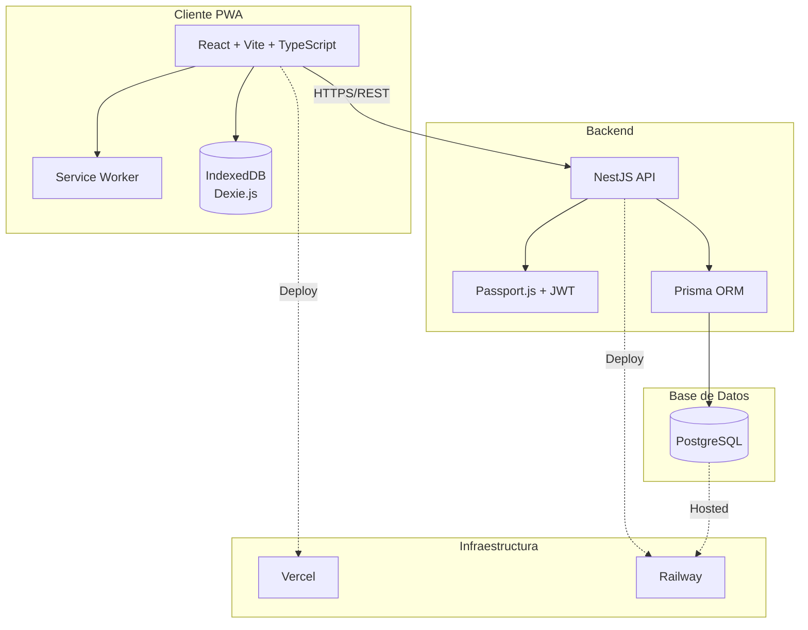
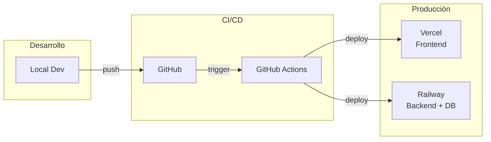
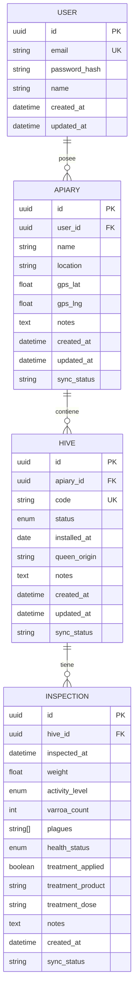

# COLMENAPP - Gestión Profesional de Apiarios

## Índice

0. [Ficha del proyecto](#0-ficha-del-proyecto)
1. [Descripción general del producto](#1-descripción-general-del-producto)
2. [Arquitectura del sistema](#2-arquitectura-del-sistema)
3. [Modelo de datos](#3-modelo-de-datos)
4. [Especificación de la API](#4-especificación-de-la-api)
5. [Historias de usuario](#5-historias-de-usuario)
6. [Tickets de trabajo](#6-tickets-de-trabajo)
7. [Pull requests](#7-pull-requests)

---

## 0. Ficha del Proyecto

| Campo | Valor |
|-------|-------|
| **Nombre completo** | Carlos San Juan Martin |
| **Nombre del proyecto** | COLMENAPP |
| **Descripción breve** | Aplicación web PWA para la gestión profesional de apiarios y colmenas, con funcionamiento offline-first, diseñada para apicultores con 100+ colmenas que necesitan registrar datos de campo de manera eficiente |
| **URL del proyecto** | *Pendiente de despliegue* |
| **URL del repositorio** | https://github.com/CarlosSJM/COLMENAPP |

### Ramas del proyecto

```
feature-entrega1-CSM    → Entrega 1: Documentación técnica
feature-entrega2-CSM    → Entrega 2: Código funcional
finalproject-CSM        → Entrega final
```

---

## 1. Descripción General del Producto

### 1.1. Objetivo

**COLMENAPP** es una aplicación web progresiva (PWA) diseñada para apicultores profesionales que gestionan múltiples apiarios y necesitan:

- **Organizar** apiarios y colmenas con identificación QR
- **Registrar** datos de campo de manera eficiente (peso, varroa, tratamientos)
- **Trabajar offline** en zonas rurales sin cobertura
- **Sincronizar** automáticamente cuando recuperen conexión
- **Exportar** datos para análisis y trazabilidad

**Problema que resuelve:** Los apicultores profesionales utilizan actualmente cuadernos de papel o apps genéricas que no funcionan sin internet en el campo, perdiendo datos o duplicando trabajo.

**Usuario objetivo:** Apicultor profesional con 100+ colmenas distribuidas en múltiples apiarios.

### 1.2. Características y Funcionalidades Principales

#### MVP (Entrega Final)

| # | Funcionalidad | Descripción |
|---|---------------|-------------|
| 1 | **Autenticación** | Registro/login con email, recuperación de contraseña, sesión persistente |
| 2 | **Gestión de Apiarios** | CRUD completo: nombre, ubicación, GPS opcional, notas |
| 3 | **Gestión de Colmenas** | CRUD con estado (activa/cuarentena/pérdida), código único, origen reina |
| 4 | **Sistema QR** | Generación automática de QR por colmena, scanner para acceso rápido |
| 5 | **Registro de Inspecciones** | Peso, actividad, conteo varroa, plagas, tratamientos, notas |
| 6 | **Historial** | Visualización cronológica de inspecciones por colmena |
| 7 | **Modo Offline** | Funciona sin conexión, sync automático al recuperar red |
| 8 | **Dashboard** | Resumen de colmenas por estado, últimas inspecciones, alertas |
| 9 | **Exportación CSV** | Descarga de datos por apiario o global |

#### Excluido del MVP (Fases futuras)

- Fotos con geolocalización
- Transcripción de voz
- Multiusuario con roles
- Calendario y notificaciones push
- NFC
- Marketplace
- IA/ML predictivo

### 1.3. Diseño y Experiencia de Usuario

#### Principios de diseño

- **Mobile-first**: Optimizado para uso en campo con móvil
- **Botones grandes**: Mínimo 48px para uso con guantes
- **Alto contraste**: Visibilidad bajo luz solar directa
- **Offline-first**: Indicadores claros de estado de conexión

#### Flujo principal del usuario

```
1. Login → Dashboard
2. Dashboard → Seleccionar Apiario → Ver Colmenas
3. Escanear QR → Ficha Colmena → Nueva Inspección
4. Rellenar datos → Guardar (local) → Sync automático
```

#### Wireframes

*Pendiente de diseño. Se incluirán capturas o enlace a Figma/wireframes antes de la Entrega 2.*

### 1.4. Instrucciones de Instalación

*Se completará durante el desarrollo. Incluirá:*

```bash
# Clonar repositorio
git clone [URL_REPOSITORIO]

# Backend
cd backend
npm install
cp .env.example .env
npx prisma migrate dev
npm run start:dev

# Frontend
cd frontend
npm install
npm run dev
```

**Requisitos:**
- Node.js 18+
- PostgreSQL 14+
- npm o yarn

---

## 2. Arquitectura del Sistema

### 2.1. Diagrama de Arquitectura



**Justificación de la arquitectura:**

| Decisión | Justificación |
|----------|---------------|
| **PWA** | Una sola base de código para web y móvil, instalable sin stores |
| **Offline-first** | Dexie.js + Service Worker para funcionar sin conexión en campo |
| **Backend propio (NestJS)** | Familiaridad del desarrollador, control total, TypeScript nativo |
| **PostgreSQL** | Robusto, gratuito, estándar de la industria |
| **Vercel + Railway** | Costes mínimos (~6€/mes), fácil despliegue, escalable |

### 2.2. Descripción de Componentes Principales

| Componente | Tecnología | Responsabilidad |
|------------|------------|-----------------|
| **Frontend PWA** | React 18 + Vite + TypeScript | Interfaz de usuario, lógica de presentación |
| **UI Components** | Tailwind CSS + shadcn/ui | Componentes accesibles, diseño responsive |
| **Offline Storage** | Dexie.js (IndexedDB) | Persistencia local, cola de sincronización |
| **Service Worker** | vite-plugin-pwa | Caché de assets, funcionamiento offline |
| **i18n** | react-i18next | Internacionalización (ES inicial, preparado para EN, PT...) |
| **API REST** | NestJS + Express | Endpoints, validación, lógica de negocio |
| **Autenticación** | Passport.js + JWT + bcrypt | Login, registro, tokens, hash de passwords |
| **ORM** | Prisma | Acceso a BD, migraciones, type-safety |
| **Base de datos** | PostgreSQL 14+ | Persistencia de datos, relaciones |

### 2.3. Descripción de Alto Nivel del Proyecto y Estructura de Ficheros

```
COLMENAPP/
├── frontend/
│   ├── src/
│   │   ├── components/        # Componentes React reutilizables
│   │   ├── pages/             # Páginas/vistas de la aplicación
│   │   ├── hooks/             # Custom hooks (useOffline, useSync...)
│   │   ├── services/          # Lógica de API y sincronización
│   │   ├── db/                # Configuración Dexie.js (IndexedDB)
│   │   ├── locales/           # Traducciones i18n (es/, en/)
│   │   ├── types/             # Tipos TypeScript compartidos
│   │   └── App.tsx
│   ├── public/
│   └── package.json
│
├── backend/
│   ├── src/
│   │   ├── auth/              # Módulo autenticación
│   │   ├── users/             # Módulo usuarios
│   │   ├── apiaries/          # Módulo apiarios
│   │   ├── hives/             # Módulo colmenas
│   │   ├── inspections/       # Módulo inspecciones
│   │   ├── sync/              # Módulo sincronización offline
│   │   ├── prisma/            # Servicio Prisma
│   │   └── main.ts
│   ├── prisma/
│   │   ├── schema.prisma      # Modelo de datos
│   │   └── migrations/
│   └── package.json
│
├── docs/                       # Documentación adicional
├── README.md                   # Este archivo
└── prompts.md                  # Registro de prompts IA
```

**Patrón arquitectónico:**
- **Frontend**: Componentes funcionales + hooks, separación por feature
- **Backend**: Arquitectura modular NestJS (módulo por dominio)

### 2.4. Infraestructura y Despliegue



**Entornos:**

| Entorno | Frontend | Backend | Base de Datos |
|---------|----------|---------|---------------|
| **Local** | localhost:5173 | localhost:3000 | PostgreSQL local |
| **Producción** | Vercel (auto) | Railway | Railway PostgreSQL |

**Proceso de despliegue:**

1. Push a rama `main` → GitHub Actions
2. Frontend: Build Vite → Deploy Vercel (automático)
3. Backend: Build NestJS → Deploy Railway (automático)
4. Migraciones Prisma ejecutadas en Railway

**Costes estimados MVP:**

| Servicio | Coste/mes |
|----------|-----------|
| Vercel (Free) | 0€ |
| Railway (Hobby) | ~5€ |
| **Total** | **~5€/mes** |

### 2.5. Seguridad

| Área | Medida | Implementación |
|------|--------|----------------|
| **Autenticación** | JWT con expiración | Tokens de 24h, refresh tokens de 7 días |
| **Passwords** | Hash seguro | bcrypt con salt rounds = 10 |
| **API** | Validación de entrada | class-validator en DTOs NestJS |
| **API** | Rate limiting | @nestjs/throttler (100 req/min) |
| **CORS** | Origen restringido | Solo dominios propios en producción |
| **HTTPS** | Cifrado en tránsito | Forzado por Vercel y Railway |
| **SQL Injection** | ORM parametrizado | Prisma (queries seguras por defecto) |
| **XSS** | Sanitización | React escapa por defecto, validación backend |
| **Datos sensibles** | Variables de entorno | Secrets en Railway, nunca en código |

**Headers de seguridad (frontend):**
- `X-Content-Type-Options: nosniff`
- `X-Frame-Options: DENY`
- `Strict-Transport-Security` (HSTS)

### 2.6. Tests

**Estrategia de testing:**

| Tipo | Herramienta | Cobertura objetivo |
|------|-------------|-------------------|
| **Unitarios Backend** | Jest + NestJS Testing | Servicios y lógica de negocio |
| **Unitarios Frontend** | Vitest + React Testing Library | Hooks y componentes críticos |
| **Integración API** | Jest + Supertest | Endpoints completos |
| **E2E** | Playwright | Flujo principal (login → inspección) |

**Tests prioritarios MVP:**

| Test | Tipo | Descripción |
|------|------|-------------|
| Auth Service | Unitario | Registro, login, validación JWT |
| Inspections Service | Unitario | CRUD inspecciones, validaciones |
| POST /inspections | Integración | Crear inspección con datos válidos/inválidos |
| Sync Service | Integración | Push/pull de datos offline |
| Flujo completo | E2E | Login → Crear apiario → Crear colmena → Registrar inspección |

**Ejecución:**
```bash
# Backend
npm run test          # Unitarios
npm run test:e2e      # Integración

# Frontend
npm run test          # Unitarios

# E2E
npm run test:e2e      # Playwright
```

---

## 3. Modelo de Datos

### 3.1. Diagrama del Modelo de Datos



**Relaciones:**
- Un **Usuario** tiene muchos **Apiarios**
- Un **Apiario** tiene muchas **Colmenas**
- Una **Colmena** tiene muchas **Inspecciones**

### 3.2. Descripción de Entidades Principales

#### USER (Usuario)

| Campo | Tipo | Restricciones | Descripción |
|-------|------|---------------|-------------|
| id | UUID | PK | Identificador único |
| email | VARCHAR(255) | UNIQUE, NOT NULL | Email del usuario |
| password_hash | VARCHAR(255) | NOT NULL | Hash bcrypt del password |
| name | VARCHAR(100) | NOT NULL | Nombre del usuario |
| created_at | TIMESTAMP | NOT NULL | Fecha de registro |
| updated_at | TIMESTAMP | NOT NULL | Última modificación |

#### APIARY (Apiario)

| Campo | Tipo | Restricciones | Descripción |
|-------|------|---------------|-------------|
| id | UUID | PK | Identificador único |
| user_id | UUID | FK → USER, NOT NULL | Propietario |
| name | VARCHAR(100) | NOT NULL | Nombre del apiario |
| location | VARCHAR(255) | | Ubicación (texto) |
| gps_lat | DECIMAL(10,8) | | Latitud GPS |
| gps_lng | DECIMAL(11,8) | | Longitud GPS |
| notes | TEXT | | Notas adicionales |
| created_at | TIMESTAMP | NOT NULL | Fecha de creación |
| updated_at | TIMESTAMP | NOT NULL | Última modificación |
| sync_status | VARCHAR(20) | DEFAULT 'synced' | Estado sync: pending/synced |

#### HIVE (Colmena)

| Campo | Tipo | Restricciones | Descripción |
|-------|------|---------------|-------------|
| id | UUID | PK | Identificador único |
| apiary_id | UUID | FK → APIARY, NOT NULL | Apiario al que pertenece |
| code | VARCHAR(50) | UNIQUE por user, NOT NULL | Código identificador |
| status | ENUM | NOT NULL | active/inactive/quarantine/lost |
| installed_at | DATE | | Fecha de instalación |
| queen_origin | VARCHAR(255) | | Origen de la reina |
| notes | TEXT | | Notas adicionales |
| created_at | TIMESTAMP | NOT NULL | Fecha de creación |
| updated_at | TIMESTAMP | NOT NULL | Última modificación |
| sync_status | VARCHAR(20) | DEFAULT 'synced' | Estado sync |

#### INSPECTION (Inspección)

| Campo | Tipo | Restricciones | Descripción |
|-------|------|---------------|-------------|
| id | UUID | PK | Identificador único |
| hive_id | UUID | FK → HIVE, NOT NULL | Colmena inspeccionada |
| inspected_at | TIMESTAMP | NOT NULL | Fecha/hora de inspección |
| weight | DECIMAL(5,2) | | Peso en kg |
| activity_level | ENUM | | low/medium/high |
| varroa_count | INTEGER | | Conteo de varroa |
| plagues | VARCHAR[] | | Array de plagas detectadas |
| health_status | ENUM | | good/regular/bad |
| treatment_applied | BOOLEAN | DEFAULT false | ¿Se aplicó tratamiento? |
| treatment_product | VARCHAR(100) | | Producto usado |
| treatment_dose | VARCHAR(50) | | Dosis aplicada |
| notes | TEXT | | Notas adicionales |
| created_at | TIMESTAMP | NOT NULL | Fecha de creación |
| sync_status | VARCHAR(20) | DEFAULT 'synced' | Estado sync |

---

## 4. Especificación de la API

### Endpoint 1: POST /auth/login

```yaml
/auth/login:
  post:
    summary: Iniciar sesión
    tags: [Auth]
    requestBody:
      required: true
      content:
        application/json:
          schema:
            type: object
            required: [email, password]
            properties:
              email:
                type: string
                format: email
                example: "apicultor@example.com"
              password:
                type: string
                format: password
                example: "miPassword123"
    responses:
      200:
        description: Login exitoso
        content:
          application/json:
            example:
              access_token: "eyJhbGciOiJIUzI1NiIs..."
              refresh_token: "eyJhbGciOiJIUzI1NiIs..."
              user:
                id: "uuid-123"
                email: "apicultor@example.com"
                name: "Juan Apicultor"
      401:
        description: Credenciales inválidas
```

### Endpoint 2: POST /inspections

```yaml
/inspections:
  post:
    summary: Crear nueva inspección
    tags: [Inspections]
    security:
      - bearerAuth: []
    requestBody:
      required: true
      content:
        application/json:
          schema:
            type: object
            required: [hive_id, inspected_at]
            properties:
              hive_id:
                type: string
                format: uuid
              inspected_at:
                type: string
                format: date-time
              weight:
                type: number
                example: 25.5
              activity_level:
                type: string
                enum: [low, medium, high]
              varroa_count:
                type: integer
                example: 3
              health_status:
                type: string
                enum: [good, regular, bad]
              treatment_applied:
                type: boolean
              treatment_product:
                type: string
              notes:
                type: string
    responses:
      201:
        description: Inspección creada
        content:
          application/json:
            example:
              id: "uuid-456"
              hive_id: "uuid-789"
              inspected_at: "2026-02-06T10:30:00Z"
              weight: 25.5
              varroa_count: 3
              sync_status: "synced"
      400:
        description: Datos inválidos
      401:
        description: No autorizado
```

### Endpoint 3: POST /sync/push

```yaml
/sync/push:
  post:
    summary: Sincronizar cambios offline al servidor
    tags: [Sync]
    security:
      - bearerAuth: []
    requestBody:
      required: true
      content:
        application/json:
          schema:
            type: object
            properties:
              apiaries:
                type: array
                items:
                  $ref: '#/components/schemas/Apiary'
              hives:
                type: array
                items:
                  $ref: '#/components/schemas/Hive'
              inspections:
                type: array
                items:
                  $ref: '#/components/schemas/Inspection'
    responses:
      200:
        description: Sincronización exitosa
        content:
          application/json:
            example:
              synced:
                apiaries: 2
                hives: 5
                inspections: 12
              conflicts: []
              server_timestamp: "2026-02-06T10:35:00Z"
      401:
        description: No autorizado
```

---

## 5. Historias de Usuario

### HU-001: Registrar inspección de colmena en campo

**Como** apicultor profesional
**Quiero** registrar los datos de una inspección desde mi móvil en el campo
**Para** tener un registro digital inmediato sin depender de papel ni conexión a internet

**Criterios de Aceptación:**
- [ ] Puedo escanear el QR de la colmena para acceder directamente al formulario
- [ ] Puedo registrar: peso, nivel de actividad, conteo varroa, estado de salud
- [ ] Puedo indicar si apliqué tratamiento y cuál producto/dosis
- [ ] Puedo añadir notas de texto libre
- [ ] Los datos se guardan localmente si no hay conexión
- [ ] Veo indicador claro de "guardado local" vs "sincronizado"
- [ ] Al recuperar conexión, los datos se sincronizan automáticamente

**Prioridad:** Must-Have
**Estimación:** 8 puntos

---

### HU-002: Gestionar apiarios y colmenas

**Como** apicultor con múltiples apiarios
**Quiero** organizar mis colmenas por apiario con códigos únicos
**Para** tener control y trazabilidad de todas mis colmenas

**Criterios de Aceptación:**
- [ ] Puedo crear, editar y eliminar apiarios
- [ ] Puedo asignar nombre, ubicación y coordenadas GPS a cada apiario
- [ ] Puedo crear colmenas dentro de cada apiario
- [ ] Cada colmena tiene código único, estado y origen de reina
- [ ] Puedo cambiar el estado de una colmena (activa/cuarentena/pérdida)
- [ ] Se genera automáticamente un código QR para cada colmena
- [ ] Puedo imprimir el QR en formato resistente a intemperie

**Prioridad:** Must-Have
**Estimación:** 5 puntos

---

### HU-003: Consultar historial y exportar datos

**Como** apicultor profesional
**Quiero** ver el historial de inspecciones de cada colmena y exportar datos
**Para** analizar tendencias y cumplir con requisitos de trazabilidad

**Criterios de Aceptación:**
- [ ] Puedo ver lista cronológica de todas las inspecciones de una colmena
- [ ] Puedo filtrar inspecciones por rango de fechas
- [ ] Veo resumen en dashboard: colmenas por estado, últimas inspecciones
- [ ] Veo alerta de colmenas sin inspeccionar en más de 30 días
- [ ] Puedo exportar datos a CSV (por apiario o global)
- [ ] El CSV incluye todos los campos de inspección

**Prioridad:** Must-Have
**Estimación:** 5 puntos

---

## 6. Tickets de Trabajo

### TK-001: Módulo de Inspecciones (Backend)

**Tipo:** Backend
**Prioridad:** Alta
**Estimación:** 8 puntos
**Historia relacionada:** HU-001

#### Descripción
Implementar el módulo completo de inspecciones en NestJS: CRUD, validaciones y endpoints de sincronización.

#### Tareas
- [ ] Crear módulo `inspections` en NestJS
- [ ] Definir DTO de creación con validaciones (class-validator)
- [ ] Implementar InspectionsService con métodos CRUD
- [ ] Implementar InspectionsController con endpoints REST
- [ ] Añadir guard de autenticación JWT
- [ ] Validar que la colmena pertenece al usuario autenticado
- [ ] Implementar filtrado por hive_id y rango de fechas
- [ ] Escribir tests unitarios del servicio
- [ ] Escribir tests de integración de endpoints

#### Criterios de Aceptación
- [ ] POST /inspections crea inspección y devuelve 201
- [ ] GET /hives/:id/inspections devuelve lista filtrada
- [ ] Validación rechaza datos inválidos con 400
- [ ] Usuario no puede acceder a inspecciones de otros usuarios
- [ ] Tests con cobertura > 80%

---

### TK-002: Formulario de Inspección Offline (Frontend)

**Tipo:** Frontend
**Prioridad:** Alta
**Estimación:** 8 puntos
**Historia relacionada:** HU-001

#### Descripción
Implementar el formulario de nueva inspección con soporte offline completo usando Dexie.js.

#### Tareas
- [ ] Crear componente `InspectionForm` con todos los campos
- [ ] Implementar selects para enums (activity_level, health_status)
- [ ] Crear checkbox para tratamiento con campos condicionales
- [ ] Integrar con Dexie.js para guardado local
- [ ] Añadir campo sync_status a registros locales
- [ ] Implementar hook `useSync` para sincronización automática
- [ ] Mostrar indicador visual de estado de conexión
- [ ] Mostrar contador de cambios pendientes
- [ ] Añadir feedback de éxito/error al guardar
- [ ] Diseño responsive para móvil (botones grandes)

#### Criterios de Aceptación
- [ ] Formulario funciona sin conexión a internet
- [ ] Datos se persisten en IndexedDB al guardar
- [ ] Al recuperar conexión, sync ocurre en < 5 segundos
- [ ] UI muestra claramente estado offline/online
- [ ] Formulario usable con guantes (botones > 48px)

---

### TK-003: Schema Prisma y Migraciones (Base de Datos)

**Tipo:** Base de Datos
**Prioridad:** Alta
**Estimación:** 5 puntos
**Historia relacionada:** HU-001, HU-002

#### Descripción
Definir el schema completo de Prisma con todas las entidades, relaciones y ejecutar migraciones.

#### Tareas
- [ ] Definir modelo User en schema.prisma
- [ ] Definir modelo Apiary con relación a User
- [ ] Definir modelo Hive con relación a Apiary
- [ ] Definir modelo Inspection con relación a Hive
- [ ] Definir enums: HiveStatus, ActivityLevel, HealthStatus
- [ ] Añadir campos de auditoría (created_at, updated_at)
- [ ] Añadir campo sync_status para offline
- [ ] Configurar índices para queries frecuentes
- [ ] Crear migración inicial
- [ ] Crear seed de datos de prueba
- [ ] Documentar comandos de migración

#### Criterios de Aceptación
- [ ] `npx prisma migrate dev` ejecuta sin errores
- [ ] `npx prisma db seed` crea datos de prueba
- [ ] Relaciones funcionan correctamente (cascadas)
- [ ] Índices creados en user_id, apiary_id, hive_id
- [ ] Schema documentado con comentarios

---

## 7. Pull Requests

### PR #1: Documentación técnica - Entrega 1

| Campo | Valor |
|-------|-------|
| **URL** | https://github.com/CarlosSJM/COLMENAPP/pull/1 |
| **Rama origen** | `feature-entrega1-CSM` |
| **Rama destino** | `main` |
| **Estado** | Entrega 1 - Documentación técnica |

**Cambios incluidos:**
- `README.md`: Documentación completa del proyecto (secciones 0-7)
- `prompts.md`: Registro de prompts de IA utilizados
- `docs/`: Documentación técnica adicional

**Descripción:**
Primera entrega del proyecto final. Incluye toda la documentación técnica:
arquitectura, modelo de datos, API spec, historias de usuario y tickets de trabajo.

---

| PR | Descripción | Estado |
|----|-------------|--------|
| PR #1 | Documentación técnica (Entrega 1) | ✅ Completado |
| PR #2 | Código funcional (Entrega 2) | ⏳ Pendiente |
| PR #3 | Entrega final (Entrega 3) | ⏳ Pendiente |

---

## Enlaces

- **Documentación técnica completa:** [docs/app_apicultura.md](docs/app_apicultura.md)
- **Propuesta comercial MVP:** [docs/propuesta_cliente_mvp.md](docs/propuesta_cliente_mvp.md)
- **Registro de prompts:** [prompts.md](prompts.md)
